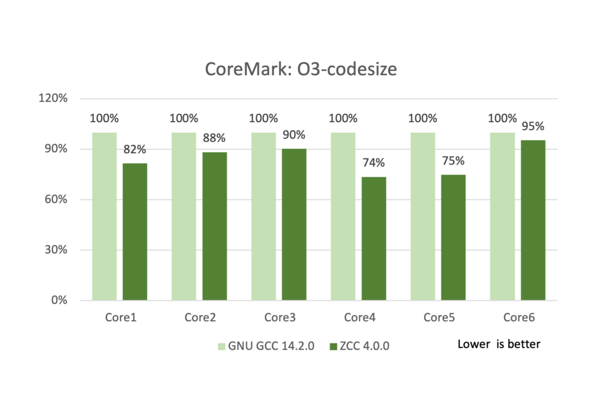
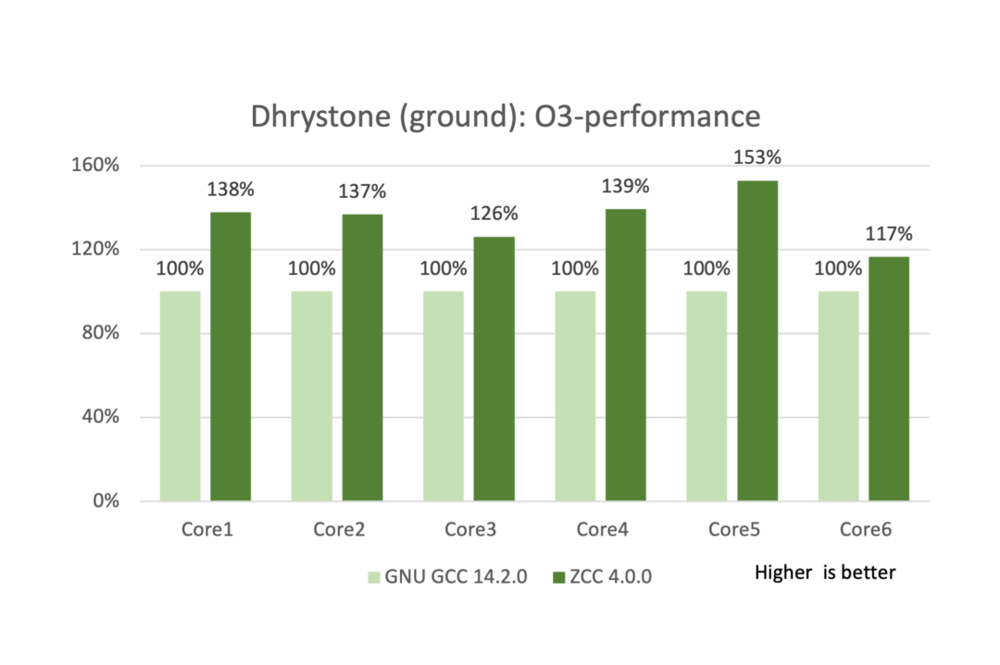
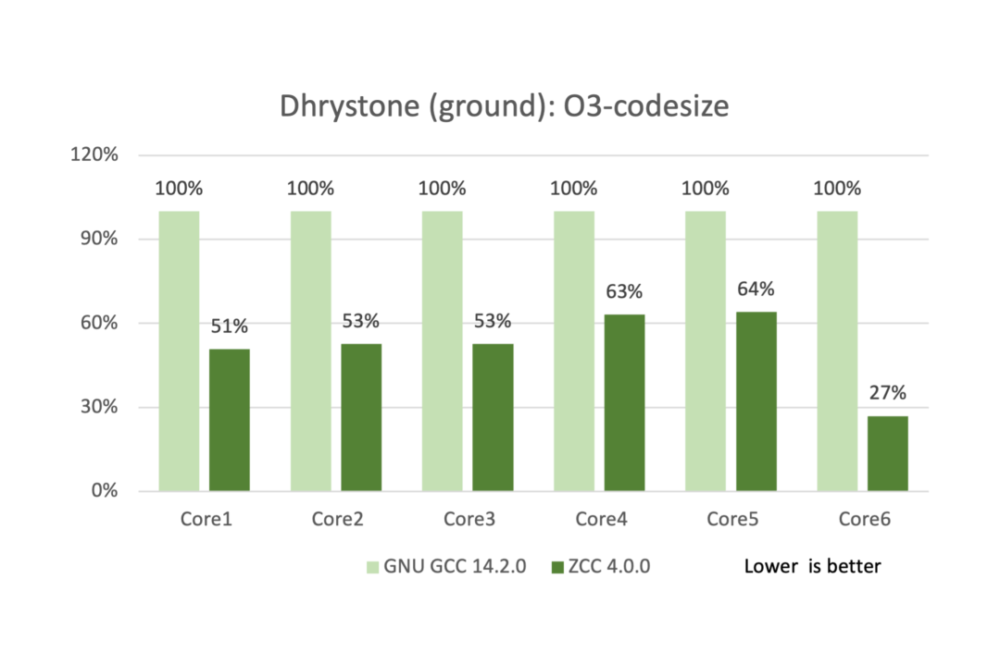

+++
title="兆松科技-zcc"
tags=["golang"]
categories=["Golang"]
date="2019-12-13T21:00:00+08:00"
toc=true
+++

2025 年 06 月 06 日，兆松[科技](https://www.elecfans.com/v/)（武汉）有限公司（以下简称“兆松科技”）宣布正式发布高性能 [RISC-V](https://bbs.elecfans.com/zhuti_riscvmcu_1.html) 编译器 ZCC 4.0.0 版本。新版本在性能优化、厂商自定义指令支持和软件库等方面实现全面升级，并同步推出免费社区版，旨在帮助[开发者](https://bbs.elecfans.com/group_1231)降低应用门槛，广泛协同产业链上下游，共同推动 [RISC](https://bbs.elecfans.com/zhuti_riscvmcu_1.html)-V 架构的应用落地与持续发展。

**主要更新**

  

ZCC 编译器基于 LLVM 框架深度开发，在指令集支持、编译优化等多个维度持续增强。ZCC 4.0.0 版本的主要更新包括：

  

完成向 LLVM 19.1.6 版本的迁移；

  

将 Newlib C 库替换为自研 [MCU](https://m.hqchip.com/app/1379)lib C 库，进一步提升编译代码密度；

  

精简 Multilib 体积，默认支持更多的 -march 选项；

  

新增对 Xuan[Ti](https://bbs.elecfans.com/group_715)e 自定义 Xthe[ad](https://bbs.elecfans.com/zhuti_1472_1.html)* 扩展指令的支持，并对部分扩展指令实现了编译优化；

  

新增 XuanTie C908 调度模型；

  

新增对 Nuclei 自定义 Xxlvqmacc 扩展指令的支持；

  

优化 Andes RISC-V 内核（D45、D25F）调度模型，性能进一步提升；

  

llvm-objcopy 工具支持导出 [Verilog](https://bbs.elecfans.com/group_378) 可读取的内存初始化文件。

  

**性能数据**

  

ZCC 4.0.0 工具链在多家 RISC-V 合作厂商（包括**玄铁、芯来、晶心、先楫**）的硬件平台上展现出卓越的性能表现，相较于开源 GNU GCC 14.2.0 工具链，ZCC 4.0.0 在 CoreMark 测试中平均可以实现**22%**的性能提升，以及**16%**的代码密度优化。Dhrystone (ground rules) 测试中， ZCC 4.0.0 平均可以实现**35%**的性能提升，以及**48%**的代码密度优化。

**玄铁团队高级技术专家盛仿伟**表示：“兆松科技作为 RISC-V 编译器领域技术领跑者，深度参与玄铁工具链生态共建，其自研编译优化技术显著提升玄铁[处理器](https://m.hqchip.com/app/1381)能效表现。兆松科技已成功为多家头部芯片企业提供定制化编译解决方案，在代码密度、执行效率等核心指标上获行业验证，可有效降低客户开发成本，是玄铁生态协同创新的理想伙伴。”

**芯来科技软件总监方华启**表示：“兆松科技的编译器工具相较于开源的 GCC 和 LLVM，在性能和 code size 方面表现出色，充分挖掘了芯来 RISC-V 处理器的潜力。此外，兆松科技推出的 ZCC FuSa 版本，全面支持芯来 NA300 和 NA900 系列，兆松科技的创新技术将有力推动 RISC-V 生态在车规等关键领域的发展。”

**晶心科技资深技术经理王庭昭**表示：“我们非常高兴能够见看见 ZCC 编译器 4.0 的发布，并持续对晶心处理器性能优化。兆松科技持续在性能、自定义指令支持等方面精进，ZCC 工具链已成为 RISC-V 解决方案中不可或缺的一部分。社区版的推出，将进一步激发开发者生态的活力，加速 RISC-V 应用的落地与普及。”

**先楫[半导体](https://m.hqchip.com/gongsi.html)软件总监钱江浩**表示：“与兆松科技在高性能 MCU 领域的合作，堪称国产 RISC-V 生态发展进程中的关键里程碑。此次合作不仅显著强化了产业链上下游的技术协同效应，更在国产芯片自主化进程中留下浓墨重彩的一笔，其深远影响预计将持续释放。合作成果集中体现在两大核心突破：

一方面，成功填补了国内高性能 RISC-V MCU 工具链的长期空白，直击传统工具链对高性能 RISC-V 架构支持不足的行业痛点，为国产基于高性能 MCU 芯片的软件开发、应用推广破除关键技术壁垒；

另一方面，彻底破解了 "芯片 - 软件" 长期割裂的困局 —— 在传统模式下，国产 MCU 研发常因深度依赖国外工具链而受制于人，此次合作则创新性构建了从 MCU 硬件到开发工具链的全栈国产化技术体系，大幅降低对西方工具的依赖度，夯实国产芯片产业的自主可控根基。

依托兆松科技在工具链开发领域的深厚技术积淀，以及其对 RISC-V 生态推广的开放包容态度，我们有理由相信，未来将涌现出更多基于高性能 RISC-V 架构的 MCU 创新应用，推动国产芯片产业迈向更广阔的发展空间。”

**License**

从 ZCC 4.0.0 起，兆松科技正式推出**免费社区版**。**社区版在功能、性能、稳定性等方面与商业版完全一致**，支持所有功能与优化，旨在为广大开发者提供零门槛的高性能 RISC-V 编译工具链体验。目前 ZCC 编译器提供以下版本及服务，**社区版和商用版主要区别在于商业用途授权限制以及技术支持模式**：

