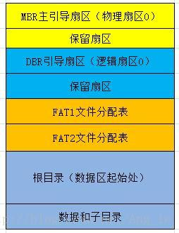
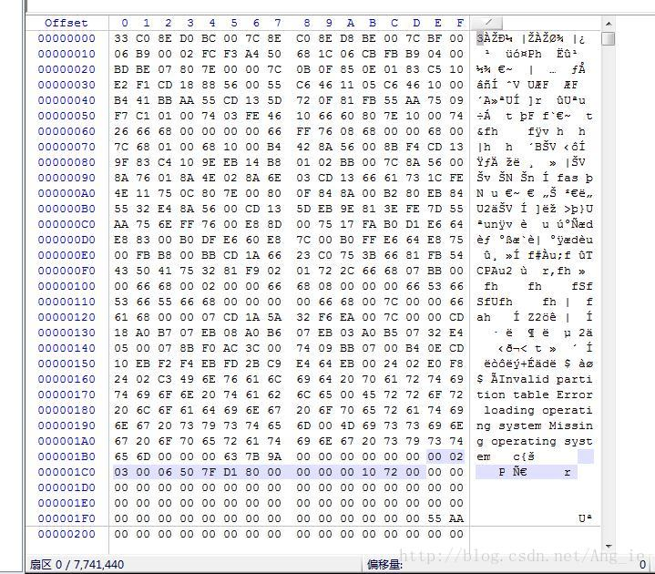
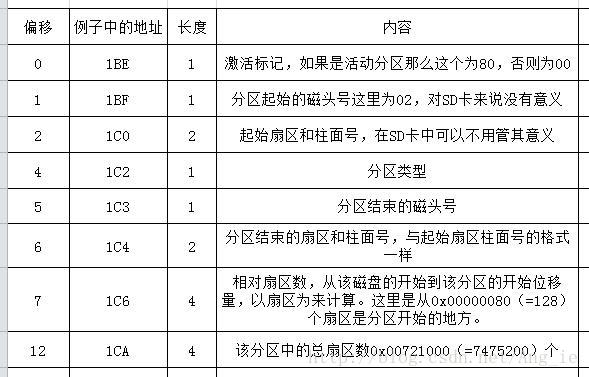
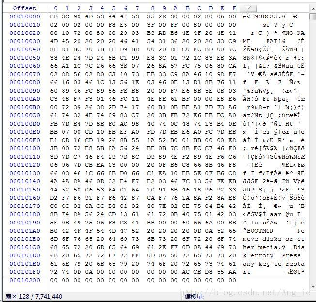
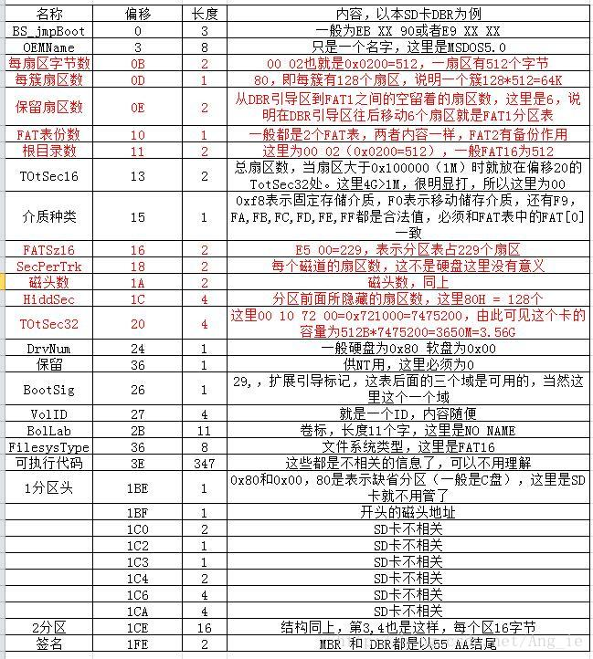
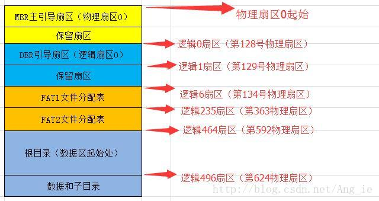
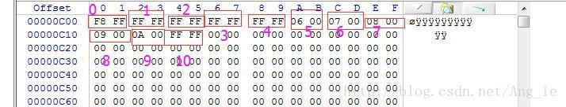
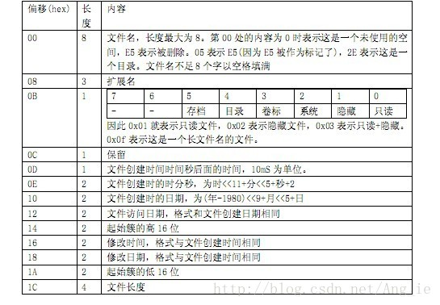
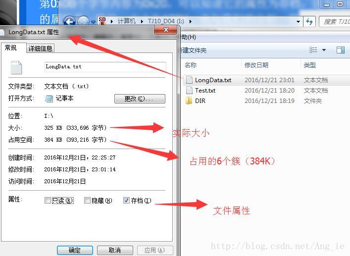
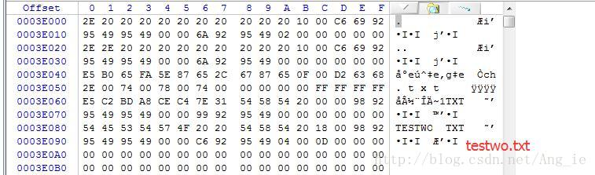

<!--more-->

## 文件系统所支持的操作系统，以市场占有率比较高的 `Windows` 为例。

| 文件系统 | 操作系统                                                                                                                                                     | 
| -------- | ------------------------------------------------------------------------------------------------------------------------------------------------------------ |
| NTFS     | Windows NT, Windows 2000, Windows XP, Windows 2003 Server, Windows 2008, Windows Vista, Windows 7                                                            |
| NTFS5    | Windows 2000, Windows XP, Windows 2003 Server, Windows 2008, Windows Vista, Windows 7, 8, 10, 11                                                             |
| exFAT    | Windows CE 6.0, Windows Vista SP1, Windows 7, WinXP+KB955704                                                                                                 |
| FAT32    | DOS 7.0 and higher, Windows 98, Windows ME, Windows 2000, Windows XP, Windows Server 2003, 2008, 2012, 2016, 2019, 2022, Windows Vista, Windows 7, 8, 10, 11 |
| FAT16    | DOS, All versions of Microsoft Windows                                                                                                                       |
| FAT12    | DOS, All versions of Microsoft Windows                                                                                                                       |

## 文件系统支持的存储大小

|                      | NTFS5                             | NTFS                                | exFAT            | FAT32                            | FAT16                               | FAT12                            |
| -------------------- | --------------------------------- | ----------------------------------- | ---------------- | -------------------------------- | ----------------------------------- | -------------------------------- |
| Max Volume Size      | 264 clusters – 1 cluster          | 232 clusters – 1 cluster            | 128PB            | 32GB for all OS, 2TB for some OS | 2GB for all OS, 4GB for some OS     | 16MB                             |
| Max Files on Volume  | 4,294,967,295 (232 - 1)           | 4,294,967,295 (232 - 1)             | Nearly Unlimited | 4194304                          | 65536                               |                                  |
| Max File Size        | 264 bytes (16 ExaBytes) minus 1KB | 244 bytes (16 TeraBytes) minus 64KB | 16EB             | 4GB minus 2 Bytes                | 2GB (Limit Only by Volume Size)     | 16MB (Limit Only by Volume Size) |
| Max Clusters Number  | 264 clusters – 1 cluster          | 232 clusters – 1 cluster            | 4294967295       | 4177918                          | 65520                               | 4080                             |
| Max File Name Length | Up to 255                         | Up to 255                           | Up to 255        | Up to 255                        | Standard - 8.3 Extended - up to 255 | Up to 254                        |

## File System Features

|                       | NTFS5                  | NTFS                   | exFAT                            | FAT32                              | FAT16                | FAT12                |     |
| --------------------- | ---------------------- | ---------------------- | -------------------------------- | ---------------------------------- | -------------------- | -------------------- | --- |
| Unicode File Names    | Unicode Character Set  | Unicode Character Set  | Unicode Character Set            | System Character Set               | System Character Set | System Character Set |     |
| System Records Mirror | MFT Mirror File        | MFT Mirror File        | No                               | Second Copy of FAT                 | Second Copy of FAT   | Second Copy of FAT   |     |
| Boot Sector Location  | First and Last Sectors | First and Last Sectors | Sectors 0 to 11 Copy in 12 to 23 | First Sector and Copy in Sector #6 | First Sector         | First Sector         |     |
| File Attributes       | Standard and Custom    | Standard and Custom    | Standard Set                     | Standard Set                       | Standard Set         | Standard Set         |     |
| Alternate Streams     | Yes                    | Yes                    | No                               | No                                 | No                   | No                   |     |
| Compression           | Yes                    | Yes                    | No                               | No                                 | No                   | No                   |     |
| Encryption            | Yes                    | No                     | No                               | No                                 | No                   | No                   |     |
| Object Permissions    | Yes                    | Yes                    | Yes                              | No                                 | No                   | No                   |     |
| Disk Quotas           | Yes                    | No                     | No                               | No                                 | No                   | No                   |     |
| Sparse Files          | Yes                    | No                     | No                               | No                                 | No                   | No                   |     |
| Reparse Points        | Yes                    | No                     | No                               | No                                 | No                   | No                   |     |
| Volume Mount Points   | Yes                    | No                     | No                               | No                                 | No                   | No                   | 、  |

## Overall Performance

|                    | NTFS5                              | NTFS                               | exFAT                 | FAT32                              | FAT16                                 | FAT12   |
| ------------------ | ---------------------------------- | ---------------------------------- | --------------------- | ---------------------------------- | ------------------------------------- | ------- |
| Built-In Security  | Yes                                | Yes                                | Yes minimal ACL only  | No                                 | No                                    | No      |
| Recoverability     | Yes                                | Yes                                | Yes if TFAT activated | No                                 | No                                    | No      |
| Performance        | Low on small volumes High on Large | Low on small volumes High on Large | High                  | High on small volumes Low on large | Highest on small volumes Low on large | High    |
| Disk Space Economy | Max                                | Max                                | Max                   | Average                            | Minimal on large volumes              | Max     |
| Fault Tolerance    | Max                                | Max                                | Yes if TFAT activated | Minimal                            | Average                               | Average |

首先看一下SD卡中的储存结构大致为下图所示：  

首先我们使用WinHex工具来打开一张SD卡，打开磁盘的时候一定要选用打开“物理储存介质”才能看到物理地址扇区0的位置。因为主引导区MBR在物理扇区0的位置。打开后可以看到如下图所示。该图为一个4G的SD卡第一个物理扇区中储存的内容，该扇区大小为512B，常称为主引导扇区，即MBR（主引导记录）。这个区在电脑硬盘上就是bios执行完ROM中的程序后在磁盘上访问的第一块空间，这里有一些引导信息，长度为466字节，地址为0x00~0x1BD。这里是SD卡，所以466字节前面的数据可以不看，从1BE开始，每16个字节代表一个分区，共有4个，我这张SD卡只有一个分区，所以只有1BE-1CD有内容，后面三个都是空的。

那么1BE-1CD中写的是些什么东西？从下表中可以分析得出结论，在看这些数据之前，一定记住这些都是用小端模式储存的，（关于大小端模式区别自己另外学习吧~）。从其中只要了解2个地方数据。一个是1C6~1C9地方的值为128，就是指分区从128号物理扇区开始，也就是逻辑扇区0的起始位置。还有1CA~1CD地方的数据表示逻辑扇区总数量。

看完了MDR引导区，根据1C6处的数据跳到物理128号扇区（逻辑扇区0）查看DBR处的数据。具体内容如下：  

128号物理扇区（逻辑扇区0）我们需要的信息有很多，我们挑选对我们单片机读写有用的信息查看，如下，图中所示，其中红色文字对我们较为有帮助的信息：  

从上面图表中可以得到一些有用的信息：  
1． 卡的大小是3.56G  
2． 每个簇有128个扇区，即64K  
3． 卡的总扇区数7475200，隐含区数128  
4． FAT表的大小为229个扇区  
根据FAT16的格式，主引导区后就是两个一样的分区表，分区表后面又跟了32个扇区作为根目录区。然后后面就是存放文件和文件夹的地方了。每个分区表既然大小算出来是229个扇区，那么FAT1在6-234扇区，FAT2就是235-463扇区，根目录就是464-495，数据区开始于496，所以第一个图可以表示为  

 在主引导区后面就是FAT表。从上面可以得知一个FAT表是229个扇区。它里边的内容很简单，里边的内容就是指出下一个簇在哪里。你的盘有多少个簇，那么它的FAT表就要有多少个项来描述它们。因为FAT16是用2个字节(16位)来描述一个簇的，所以这时FAT表的大小就应该是2位的簇数个字节。FAT表中，第4，5个簇表示第2个簇，第6，7个字节表示第3个簇，第8,9字节表示第4个簇……。就这样，每一个簇都有两个和它对应的字节。这两个字节里面存放的数据就是下一个64K数据所在的簇号。2个字节最大能表示65535，一个簇最大为64K，所以FAT16最多能给65535*64K≈4G。这就是为什么大小为4G的FAT16格式SD卡簇大小必须为64K大小原因。实际上，并不是所有的数值都代表簇号，有几个值被赋于了特定的含义， 我们先看看这几个特殊值代表的含义。

下面插入本SD卡中的一个FAT区的：  

上面是我的SD卡中FAT1分区表中的内容。它一开始就是F8 FF FF FF，从前面的特殊数值中可以知道，这就是磁盘的标识，并且第1簇已经被根目录项占用了。我的SD卡里有一个文件，名子叫LongData.txt。它的第一个簇的地址是0x0005。这个地址从哪里得来的要看后面的内容了，暂且就把它当已知条件吧。这也就是说，在SD卡的第5个簇里边存放着LongData.txt的第1个64K数据，那么它的第二个64K放在哪里呢，我们要看FAT表，第5个簇对应于FAT表中的第10，11个字节，里边的内容为0006，也就是说第2个64K数据在第6个簇里。第6个簇对应的FAT表中的数据又是什么呢，原来是0007，也就是说第3个64K的数据在第7个簇里。这样继续跟踪，我们发现，第10个簇里的数据是FFFF，FFFF是什么意思？看一下特殊数值的含义，原来这是最后一个簇，也就是说，我的LongData.txt文件到此为止。于是我们只要跟着FAT表的“指路”顺利地把LongData.txt文件从SD卡中找到了。它在卡里占用了6个簇，我的卡里边1个簇为64K，所以这个文件的大小也就最多为384K了。所以我们只要根据SD卡的读写方法，把第5-10簇里的内容读出来就OK了。 
注意一下，我这张卡是格式化过的，分区表没有碎片，所以文件的簇和簇都是连在一起的，但实际上并不一定都是连着的，一定要通过FAT表中的指示去寻找下一个簇所在的位置。 
说完FAT表，下面应该来看根目录区了。根目录区里面放的东西就是根目录下所见的东西，根据对引导扇区的分析，我们可以找到根目录区在第464扇内。用winhex打开第464个扇区 ，如下图所示：  

FAT16和FAT32每个文件名都占32个字节，这里放的是短文件名，也就是“8.3”格式的。  
但FAT16的根目录区只有32个扇区，计算一下，每个扇区512字节，共32个扇区，而每个文件要占用32个字节，很显然，根目录只能放512个文件了。因此，FAT16的根目录下只能放512个文件(及文件夹)就是这个原因。 先看前32字节，它的内容是这样的  

就看最前面的32字节吧，它表示了一个文件(或文件夹)，现在对它分析一下。前11个字是文件名。从后面的ASCII表中可以看出，它就是我写进去的那个名为LongData.txt文件。  
第0x0B个字节内容为0x20（0010 0000），可以知道它的属性为存档（文件），如下图这与我们从windows中观察到的它的属性是一致的。大小为384K，也与我们的分析一致  

再从根目录表看一下创建和修改日期吧。找到对应的字节95 49。它代表的值为0x4995，把它弄成2进制就是0100 1001 1001 0101 ，把它按格式分析一下，0100100年1100月10101日，换成十进制就是年36，加上1980为2016年。月份为12，日期为21。与上图显示结果一致。时间也一样分析，这就不再举例了。  
再看第二项，就是offset为0003A060那行，文件夹名是DIR，没有后缀名。偏移地址0A处对应的数据为2，对照着表看一下，它是一个文件夹。按上面的方法分析它，它开始于第2个簇。我这个文件夹下面放的是一个文件，名子叫testwo.txt。根据刚才的经验，那第一个表项一定是以testwo.txt开头的，没有后缀名，属性为文件夹跟踪过去看一下再说。  

咦？不对哦，它是2E，后面是空格。第二项，也不对，它是2E2E，后面也是空格，直到第三项才是我预想的文件。 那前面那个项，一个是2E，一个是2E 2E，它倒底是何方神圣，对照ASCII表，它就是一个小点 `'.'`。这个小点什么意思，那第二项就是 `'..'`，有没有什么启发？——DOS！那个古老的操作系统是怎么访问文件夹的？cd ..就是返回上一层目录。难道……？没错！就是它，一个点代表当前目录，两个点代表上级目录。看一下当前目录那一项，观察一下它的地址为0002，就是这个目录。而‘..’对应的那一项，分析一下地址。00 00，也就是根录。所以就可以利用这里找到上一级目录，于是就可以实现一级一级目录的访问了。  
这是我对FAT16的认识，以上是我想和有兴趣的朋友分享的知识，理解写作水平有限， 还望各位朋友指正。

