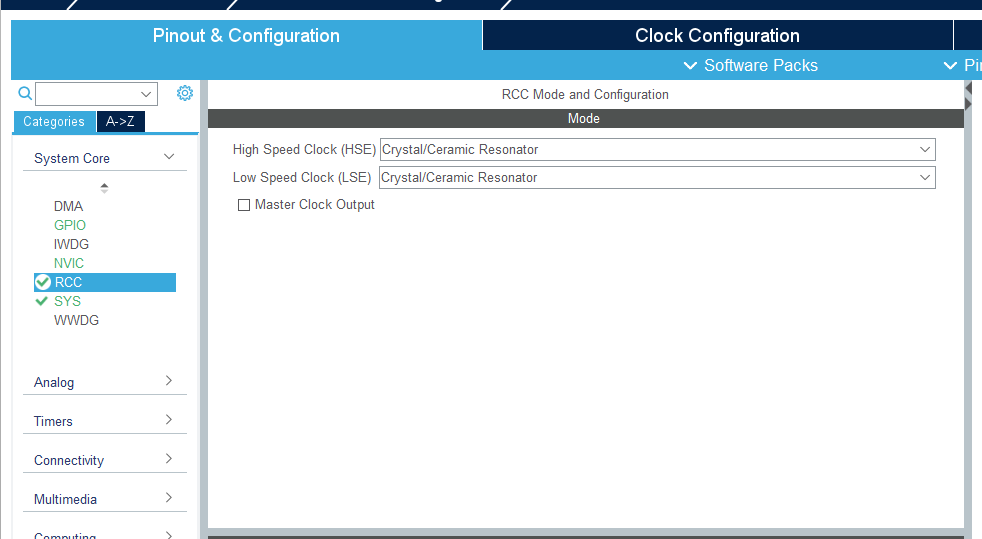
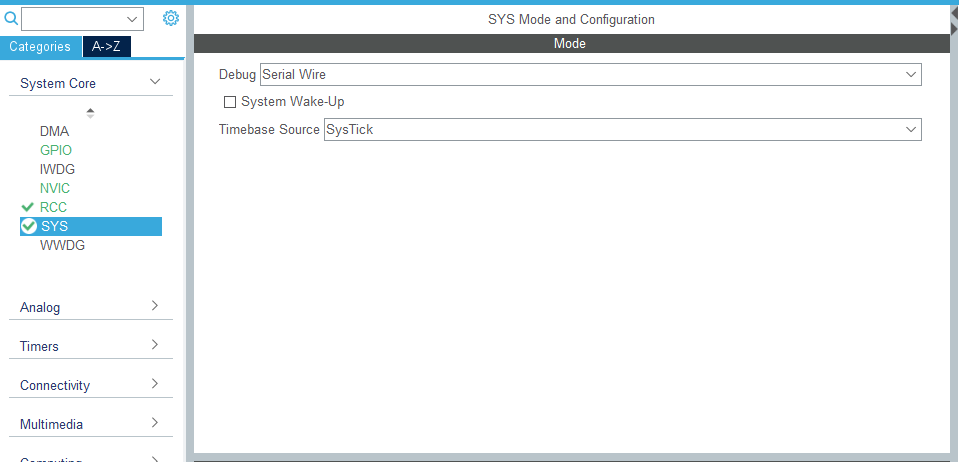
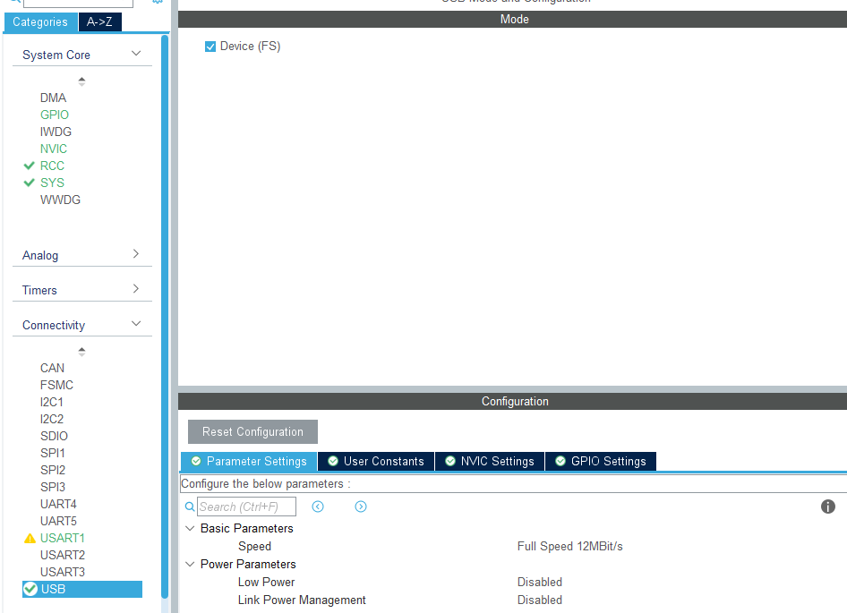
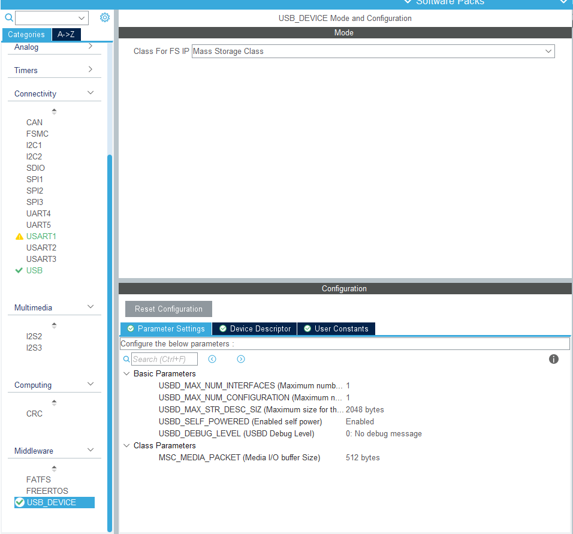
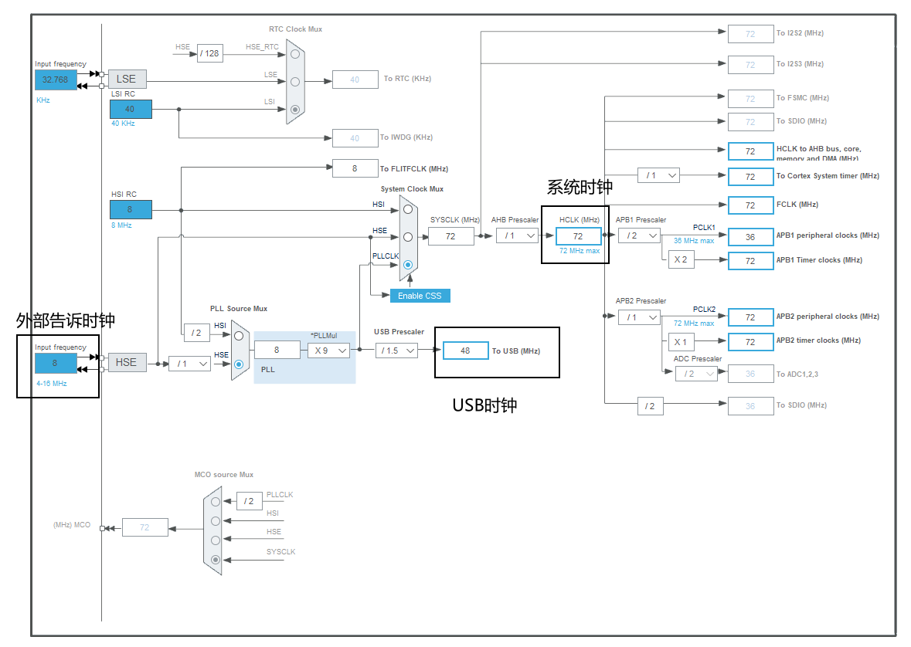
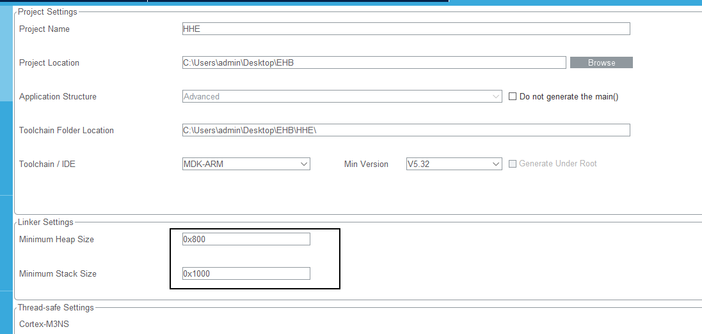
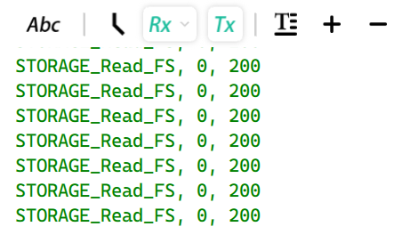
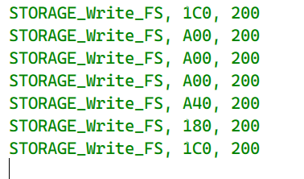
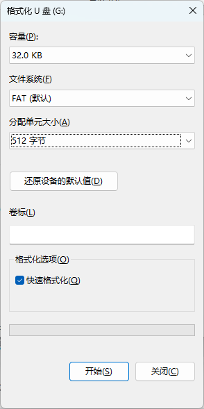
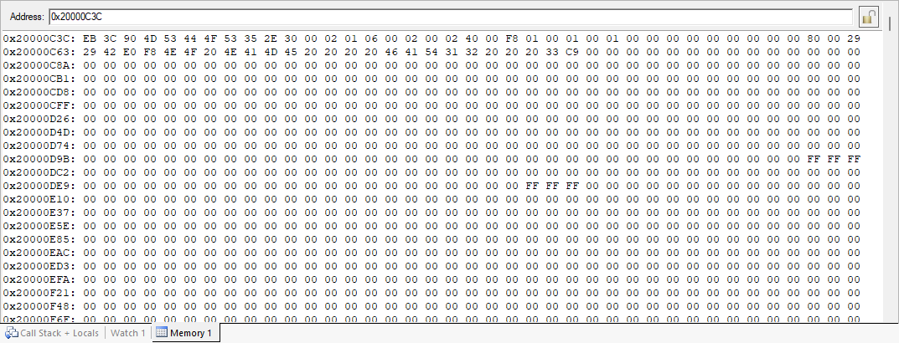

<!--more-->

BootLoader可以作为系统运行的第一个程序，其主要作用：
- 自检当前系统环境
- 引导应用程序执行
- 更新应用程序代码或参数

其传输方式也多样，以物理通信方式，可以分为：串口、CAN总线、以太网、USB、远传模块。以通信协议，可以分为：Xmodem、Zmodem、CCP、UDS、DFU等，但是都需要有一个上位机，以规定的通信协议内容，进行数据传输。但是还有一种下载方式：文件系统（File System）。可以只依靠USB接口，就可以在电脑上虚拟一个U盘。只需要将待下载的文件放入其中，断开USB线缆，则自动完成应用更新。

以下对U盘更新方式做一个简要的分析。

硬件：
- STM32F103ZET6
- USB-A TO Micro-USB-B
- ST-Link 调试器

软件：
- Keil 5.24
- VOFA+ 1.3.10
- STM32CuBeMx 6.5.0



使用 RAM 作为文件系统的存储介质，是不占用Flash空间，且在当前应用内，可以独享RAM整个空间，比较适合RAM空间大，且FLASH空间不足的情况。且RAM执行路率和 FLASH 和外部存储介质也较快。



## 1. 配置模块

默认各位大佬是使用过 `STM32CubeMx` 软件，且可以完成工程的创建，理解各个选项卡的意思。如果没有上述基础，出门右转，买一本《STM32CubeMx 使用指南》看看。

### 1.1  初始化模块

> 选择外部告诉晶振（8M）




> 选择你当前的调试方式。如果选择错误或者没有选择，则可能会出现下次无法连接调试器的问题。



> 开启串口1作为调试串口


> 打开 USB 设备



### 2.2 配置USB设备类型

- 配置USB设备类型为 MSC 存储
- 调整 `**USBD_MAX_STR_DESC_SIZ**` 的数值为： 512




### 2.3 配置时钟树

外部高度时钟需要和 **同学们自己** 时钟的开发板时钟保持一致，我这边选择的是 8MHz。

下面固定配置：
- USB 时钟需要配置为 48MHz
- 系统时钟需要配置为 72MHz




### 2.4 生成代码

选择 `Project Manager / Project` 中的链接设置，调整堆栈大小。建议栈空间：0x800，堆空间：0x1000。



点击右上方的 `GENERATE CODE` 按钮，生成代码。


以上，也就完成了STM32系统模块的配置，下面我们进入到编写程序阶段。

## 2. 虚拟U盘

我们虚拟了一个 `MSC` 存储设备，在使用USB线，连接电脑和开发板后，就可以在`我的电脑`里看到有一个未初始化的U盘盘符。可以看到，U盘未处理的情况下，是无法使用状态。我们接下来的任务，就是将虚拟U盘完成上电初始化。


### 2.1  补充读写函数

首先，我们来进入激动人心的"点灯”环节。
重新打开 `STM32CubeMx` 软件，按照开发板的 `LED` 引脚，配置一个模式为输出的 `GPIO`。

在循环体中，添加 `控制LED闪烁` 的代码，用来确认当前系统在正常执行。

``` C main.c
// main.c 

int main(void)
{
  // 时钟、外设的初始化

  while (1)
  {
	PBout(5) = flg;
	flg = !flg;
	HAL_Delay(200);
    /* USER CODE END WHILE */

    /* USER CODE BEGIN 3 */
  }
}
```


打开 `usbd_storage_if.c` 文件，按照实际情况，填写块数量和块大小。

由于我当前使用 `RAM` 作为分区暂存，所以设定大小为32KB。
```C
title: usbd_storage_if.c

// usbd_storage_if.c
#define STORAGE_LUN_NBR                  1
#define STORAGE_BLK_NBR                  0x10000
#define STORAGE_BLK_SIZ                  0x200

#undef  STORAGE_BLK_NBR
// 重新设置 U盘 空间为32KB
#define STORAGE_TOTLE    0x8000
#define STORAGE_BLK_NBR  (STORAGE_TOTLE/STORAGE_BLK_SIZ)
// RAM 缓冲区
uint8 buffer[STORAGE_TOTLE];
```

接下来补充读写函数，开发板在初始化 MSC 设备时，需要和实际存储区域交互数据，主要是配置信息。

```C
int8_t STORAGE_Read_FS(uint8_t lun, uint8_t *buf, uint32_t blk_addr, uint16_t blk_len)
{
  /* USER CODE BEGIN 6 */
	if (lun == 0)
	{
		printf("%s, %X, %X\n", __func__, blk_addr*STORAGE_BLK_NBR, blk_len*STORAGE_BLK_SIZ);
		memcpy(buf, buffer+blk_addr*STORAGE_BLK_NBR, blk_len*STORAGE_BLK_SIZ);
	}
  return (USBD_OK);
  /* USER CODE END 6 */
}


int8_t STORAGE_Write_FS(uint8_t lun, uint8_t *buf, uint32_t blk_addr, uint16_t blk_len)
{
  /* USER CODE BEGIN 7 */
	if (lun == 0)
	{
		printf("%s, %X, %X\n", __func__, blk_addr*STORAGE_BLK_NBR, blk_len*STORAGE_BLK_SIZ);
		memcpy(buffer+blk_addr*STORAGE_BLK_NBR, buf, blk_len*STORAGE_BLK_SIZ);
	}
  
  return (USBD_OK);
  /* USER CODE END 7 */
}

```


USB在连接到电脑之后，可以看到串口有信息输出。电脑和开发板在交互数据。但是由于我们使用RAM空间，所以复位之后，数据全部为0，所以当前无法被识别为U盘设备。



在电脑上，执行格式化命令，可以从串口看到，开发板在执行写函数



格式化完成之后，可以按到U盘可以正常使用，且大小为 12KB。


但是在格式化的时候，显示可用空间为32KB。




## 增加文件系统和上电自动格式化

由于我们定义的 RAM 空间过于小，所以选择的是 FAT16 类型系统，可以更好的支持小内存设备。如果使用外部 FLASH 芯片，则可以选择上 FAT32 或者 extFat。


新建 `fat16.c` 文件，内容如下：

``` C
// fat16.c

/******************************************************************************
*                                                  
*  (c) copyright Freescale Semiconductor 2008
*  ALL RIGHTS RESERVED
*
*  File Name: FAT16.c
*                                                                          
*  Purpose: This file is for a USB Mass-Storage Device bootloader.  This file 
*           mimics a FAT16 drive in order to enumerate as a disk drive
*                                                                          
*  Assembler:  Codewarrior for Microcontrollers V6.2
*                                            
*  Version:  1.3
*                                                                          
*                                                                          
*  Author: Derek Snell                             
*                                                                                       
*  Location: Indianapolis, IN. USA                                            
*                                                                                  
* UPDATED HISTORY:
*
* REV   YYYY.MM.DD  AUTHOR        DESCRIPTION OF CHANGE
* ---   ----------  ------        --------------------- 
* 1.3   2009.01.13  Derek Snell   Added linker SEGMENTs for S08 version
* 1.2   2008.11.24  Derek Snell   Added Volume label "BOOTLOADER" to FAT16 root directory
* 1.1   2008.09.17  Derek Snell   Updated to give S19 address error in status
* 1.0   2008.06.10  Derek Snell   Initial version
* 
*
******************************************************************************/                                                                        
/* Freescale  is  not  obligated  to  provide  any  support, upgrades or new */
/* releases  of  the Software. Freescale may make changes to the Software at */
/* any time, without any obligation to notify or provide updated versions of */
/* the  Software  to you. Freescale expressly disclaims any warranty for the */
/* Software.  The  Software is provided as is, without warranty of any kind, */
/* either  express  or  implied,  including, without limitation, the implied */
/* warranties  of  merchantability,  fitness  for  a  particular purpose, or */
/* non-infringement.  You  assume  the entire risk arising out of the use or */
/* performance of the Software, or any systems you design using the software */
/* (if  any).  Nothing  may  be construed as a warranty or representation by */
/* Freescale  that  the  Software  or  any derivative work developed with or */
/* incorporating  the  Software  will  be  free  from  infringement  of  the */
/* intellectual property rights of third parties. In no event will Freescale */
/* be  liable,  whether in contract, tort, or otherwise, for any incidental, */
/* special,  indirect, consequential or punitive damages, including, but not */
/* limited  to,  damages  for  any loss of use, loss of time, inconvenience, */
/* commercial loss, or lost profits, savings, or revenues to the full extent */
/* such  may be disclaimed by law. The Software is not fault tolerant and is */
/* not  designed,  manufactured  or  intended by Freescale for incorporation */
/* into  products intended for use or resale in on-line control equipment in */
/* hazardous, dangerous to life or potentially life-threatening environments */
/* requiring  fail-safe  performance,  such  as  in the operation of nuclear */
/* facilities,  aircraft  navigation  or  communication systems, air traffic */
/* control,  direct  life  support machines or weapons systems, in which the */
/* failure  of  products  could  lead  directly to death, personal injury or */
/* severe  physical  or  environmental  damage  (High  Risk Activities). You */
/* specifically  represent and warrant that you will not use the Software or */
/* any  derivative  work of the Software for High Risk Activities.           */
/* Freescale  and the Freescale logos are registered trademarks of Freescale */
/* Semiconductor Inc.                                                        */ 
/*****************************************************************************/


#include "string.h"
#include "stdlib.h"
#include "FAT16.h"
#include "main.h"


/********************************************************************
*********************************************************************
*       FAT16 Boot Sector
*********************************************************************
********************************************************************/
const uint8_t FAT16_BootSector[FATBootSize]= 
{
    0xEB,           /*00 - BS_jmpBoot */
    0x3C,           /*01 - BS_jmpBoot */
    0x90,           /*02 - BS_jmpBoot */
    'M','S','D','O','S','5','.','0',    /* 03-10 - BS_OEMName */
    0x00,           /*11 - BPB_BytesPerSec = 2048 */
    0x02,           /*11 - BPB_BytesPerSec = 2048 */
    0x01,           /*13 - BPB_Sec_PerClus = 2K*4 = 8K*/
    6,              /*14 - BPB_RsvdSecCnt = 2 */
    0,              /*15 - BPB_RsvdSecCnt = 2 */
    2,              /*16 - BPB_NumFATs = 2 */
    0x0,            /*17 - BPB_RootEntCnt = 512 */
    0x2,            /*18 - BPB_RootEntCnt = 512 */
    0x40,              /*19 - BPB_TotSec16 = 0 */
    0,              /*20 - BPB_TotSec16 = 0 */
    0xF8,           /*21 - BPB_Media = 0xF8 */
    0x01,           /*22 - BPBFATSz16 = 0x000D */
    0,              /*23 - BPBFATSz16 = 0x000D */
    0x01,           /*24 - BPB_SecPerTrk = 0x003F */
    0,              /*25 - BPB_SecPerTrk = 0x003F */
    0x01,           /*26 - BPB_NumHeads = 255 */
    0,              /*27 - BPB_NumHeads = 255 */
    0,              /*28 - BPB_HiddSec = 0 */
    0,              /*29 - BPB_HiddSec = 0 */
    0,              /*30 - BPB_HiddSec = 0 */
    0,              /*31 - BPB_HiddSec = 0 */
    0x00,           /*32 - BPB_TotSec32 = */
    0x00,           /*33 - BPB_TotSec32 = 0x0000C800 100Mb*/
    0x00,           /*34 - BPB_TotSec32 = */
    0x00,           /*35 - BPB_TotSec32 = */
    0x80,           /*36 - BS_DrvNum = 0x80 */
    0,              /*37 - BS_Reserved1 = 0 , dirty bit = 0*/ /* Updated from FSL*/
    0x29,           /*38 - BS_BootSig = 0x29 */
    0xA3,           /*39 - BS_VolID = 0x02DDA5BD */
    0x07,           /*40 - BS_VolID = 0x02DDA5BD */
    0xD0,           /*41 - BS_VolID = 0x02DDA5BD */
    0xB0,           /*42 - BS_VolID = 0x02DDA5BD */
    'N','O',' ','N','A','M','E',' ',' ',' ',' ',  /*43-53 - BS_VolLab */
    'F','A','T','1','6',' ',' ',' '   /*54-61 - BS_FilSysType */
};

/********************************************************************
*********************************************************************
*       First Sector of FAT Table
*********************************************************************
********************************************************************/
const uint8_t FAT16_TableSector0[FATTableSize]= 
{
    0xF8,0xFF,0xFF,0xFF
};

/********************************************************************
*********************************************************************
*       FAT Root Directory Sector
*********************************************************************
********************************************************************/

uint8_t FAT16_ReadyFileName[FATFileNameSize]= 
{
    'R','E','A','D','Y',' ',' ',' ','T','X','T'    /*00-10 - Short File Name */
};

// TODO
// Change Finish to Success

const uint8_t FAT16_RootDirSector[FATDirSize]= 
{
    0x20,           /*11 - Archive Attribute set */
    0x00,           /*12 - Reserved */
    0x4B,           /*13 - Create Time Tenth */
    0x9C,           /*14 - Create Time */
    0x42,           /*15 - Create Time */
    0x92,           /*16 - Create Date */
    0x38,           /*17 - Create Date */
    0x92,           /*18 - Last Access Date */
    0x38,           /*19 - Last Access Date */
    0x00,           /*20 - Not used in FAT16 */
    0x00,           /*21 - Not used in FAT16 */
    0x9D,           /*22 - Write Time */
    0x42,           /*23 - Write Time */
    0x92,           /*24 - Write Date */
    0x38,           /*25 - Write Date */
    0x00,           /*26 - First Cluster (none, because file is empty) */
    0x00,           /*27 - First Cluster (none, because file is empty) */
    0x00,           /*28 - File Size */
    0x00,           /*29 - File Size */
    0x00,           /*30 - File Size */
    0x00,           /*31 - File Size */
    'B','O','O','T','L','O','A','D','E','R',' ',  /*32-42 - Volume label */
    0x08,           /*43 - File attribute = Volume label */
    0x00,           /*44 - Reserved */
    0x00,           /*45 - Create Time Tenth */
    0x00,           /*46 - Create Time */
    0x00,           /*47 - Create Time */
    0x00,           /*48 - Create Date */
    0x00,           /*49 - Create Date */
    0x00,           /*50 - Last Access Date */
    0x00,           /*51 - Last Access Date */
    0x00,           /*52 - Not used in FAT16 */
    0x00,           /*53 - Not used in FAT16 */
    0x9D,           /*54 - Write Time */
    0x42,           /*55 - Write Time */
    0x92,           /*56 - Write Date */
    0x38,           /*57 - Write Date */
};

FAT_DIR_t FileAttr;

/*********************************************************
* Name: FATReadLBA
*
* Desc: Read a Logical Block Address 
*
* Parameter: FAT_LBA - Logical Block Address to Read
*            pu8DataPointer - Pointer to array to store data read  
*
* Return: None
*             
**********************************************************/
uint32_t FATReadLBA(uint32_t FAT_LBA,uint8_t* data, uint32_t len)
{
    /* Body */
    int32_t i;
    switch (FAT_LBA) 
    {
        /* Boot Sector */
        case 0:
            /* Write Boot Sector info */
            for(i=0;i<FATBootSize;i++)
            {
                *data++ = FAT16_BootSector[i];
            } /* EndFor */
            /* Rest of sector empty except last two bytes */
            i += 2;
            while (i++ < 512) 
            {
                *data++ = 0;
            } /* EndWhile */
                        
            break;
        /* FAT Table Sector */
        case 0x1000: //26K-FAT0
        case 0xD800: //26K-FAT1
            /* Write FAT Table Sector */
            for(i=0;i<FATTableSize;i++)
            {
                *data++ = FAT16_TableSector0[i];
            } /* EndFor */
            /* Rest of sector empty */
            while (i++ < FATBytesPerSec) 
            {
                *data++ = 0;
            } /*ENdWhile */
            break;
            
        /* Root Directory Sector */
        case 0xE000: //16K
            
            for(i=0;i<FATFileNameSize;i++) 
            {
                *data++ = FAT16_ReadyFileName[i];
            } /* EndFor */
                            
            /* Write rest of file FAT structure */
            for(i=0;i<FATDirSize;i++) 
            {
                *data++ = FAT16_RootDirSector[i];    
            } /* EndFor */
        
            /* Rest of sector empty to signify no more files */
            i += FATFileNameSize;
            while (i++ < FATBytesPerSec) 
            {
                *data++ = 0;
            } /* EndWhile */
            break;
            
          /* All other sectors empty */
        default:
            i = 0;
            while (i++ < FATBytesPerSec) 
            {
                *data++ = 0;
            } /* EndWhile */
            break;
    } /* EndSwitch */
    
    return FATBytesPerSec;
} /* EndBody */

uint32_t FATWriteLBA(uint32_t FAT_LBA,uint8_t* data, uint32_t len)
{
    switch(FAT_LBA)
    {
        case 0x0000: // 4K   Boot Sector
        case 0x1000: // 26K  FAT0
        case 0xD800: // 26K  FAT1
             break;
        case 0xE000: // 16K  Root Directory
             FAT_RootDirWriteRequest(FAT_LBA, data, len);
//             mHex = hex_newobject();
             break;
        default:
             {
                if(FAT_LBA >= 0x16000)
                {    
                    FAT_DataSectorWriteRequest(FAT_LBA, data, len);
                }
             }
             break;
    }
    
    return FATBytesPerSec;
}

```

在 `2.1` 中完成格式化动作之后，可以在调试模式下，看到 `buffer` 里填充的数据，是文件系统的配置信息。
可以把 `buffer` 的配置作为参考，重新补充一下 `FAT16_BootSector` 变量的值。




修改 `STORAGE_Read_FS` 和 `STORAGE_Read_FS` 两个函数，让这两个函数去读写 `FAT16` 文件系统内容。

``` C

int8_t STORAGE_Read_FS(uint8_t lun, uint8_t *buf, uint32_t blk_addr, uint16_t blk_len)
{
  /* USER CODE BEGIN 6 */
	if (lun == 0)
	{
		printf("%s, %X, %X\n", __func__, blk_addr*STORAGE_BLK_NBR, blk_len*STORAGE_BLK_SIZ);
		FATReadLBA(blk_addr*STORAGE_BLK_NBR, buf, blk_len*STORAGE_BLK_SIZ);
	}
  return (USBD_OK);
  /* USER CODE END 6 */
}


int8_t STORAGE_Write_FS(uint8_t lun, uint8_t *buf, uint32_t blk_addr, uint16_t blk_len)
{
  /* USER CODE BEGIN 7 */
	if (lun == 0)
	{
		printf("%s, %X, %X\n", __func__, blk_addr*STORAGE_BLK_NBR, blk_len*STORAGE_BLK_SIZ);
		FATWriteLBA(blk_addr*STORAGE_BLK_NBR, buf, blk_len*STORAGE_BLK_SIZ);
	}
  
  return (USBD_OK);
  /* USER CODE END 7 */
}
```

下载完成之后，就可以看到U盘信息自动更新了。


如果不能正常更新，那就需要重新拔插一下 USB 口，或者重新给开发板上电。


至此，使用RAM空间作为文件系统，且可以作为U盘，连接到电脑。  那么接下来就由各位发挥想象力，在这个项目上，看能玩出什么花样。


