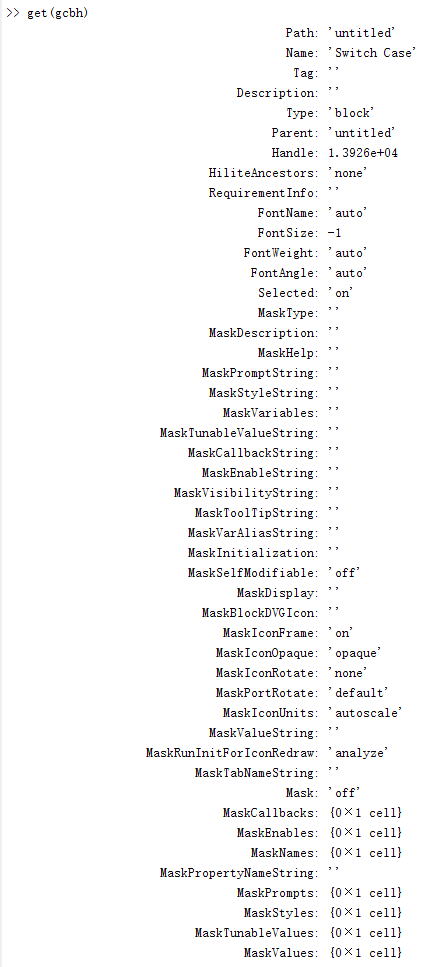

<!--more-->


## 属性

Simulink 模块的属性：

`gcb`: 获取当前被选中的模块，get current block
`gcbh`: 获取当前被选中的模块句柄，get current block handle
`get(handle)`: 获取模块的属性信息，handle表示模块的句柄
`inspect(handle)`:  通过属性观察器方式罗列模块的属性信息
`get_param(block, prop_string)`: 获取block模块的prop_string属性
`set_param(block, prop_string, prop_value)`: 设置block模块的prop_string属性。  prop_string和prop_value的数值可以成对出现。其形式一般为：set_param(block, prop_string, prop_value, prop_string, prop_value......)
gcbh是基于Simulink模型的编程中常用的函数，短小精湛，可以直接返回当前选中模块的句柄。


可以在 `Command Window` 中，输入 `get(gcbh)` 来查看当前模块所包含的信息。





上图中，左侧是属性或函数名称，右侧是对应属性的值。
由于每个模块的属性都不尽相同，所以下方只简单介绍一点常用属性和共同属性。


| 属性名称        | 作用                                                                        |
| --------------- | --------------------------------------------------------------------------- |
| Path            | 模块在模型中的路径，如 untitled/subsystem1                                  |
| Name            | 模块名字，如Constant1                                                       |
| ShowName        | 模块名字是否显示出来                                                        |
| BlockType       | 模块的类型名，如Gain,Constant                                               |
| Handle          | 模块的句柄，double型数据显示                                                |
| Position        | 模块的边框在当前模型中的位置（单位：像素）。形式如：[left top right bottom] |
| ForegroundColor | 模块的当前颜色，即模块边框即外观显示线条的颜色                              |
| BackgroundColor | 模块的背景颜色                                                              |
| Sample Time     | 模块的采样时间                                                              |
| FontAngle       | 字体斜度                                                                    |
| FontName        | 字体名字                                                                    |
| FontSize        | 字体尺寸                                                                    |
| FontWiegth      | 字体粗度                                                                    |
| Priority        | 模块的优先级，即模块的执行顺序                                              |
| InitFcn         | 模块初始化时，所需要执行的回调函数                                          |
| StartFcn        | 模块开始仿真时，所执行的回调函数                                            |
| PauseFcn        | 模块仿真暂停时，所执行的回调函数                                            |
| Value           | Canstant模块表示的数值，是该模块的特有参数                                  |
| xxxFcn          | 其他条件触发的回调函数，如Init,Copy,Open,Start,Close等                      |


在 `2018b` 版本上，空白位置上双击鼠标左键，输入 `Constant` 选择第一个匹配的模块。


可以在模型内，看到一个常量模块。该模块就是一个简单的常量输出，其模块的值可以是各种数据类型，也包括矩阵。


双击模块，可以设置模块的值。该值是一个常量，在代码生成之后，就是一个值。


右键该模块，并选择属性。

第一页（General），配置当前的模块优先级和Tag。其余配置信息后续在其他章节介绍。


## 使用函数

`set_param` :

执行 `set_param(gcbh, 'BackgroundColor', 'red')` 后，当前选中的 `Constant` 模块背景变为红色。


`get_param` :

``` matlab
>> get_param(gcbh, 'BackgroundColor')

ans =

    'red'

```


