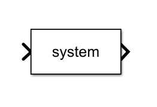
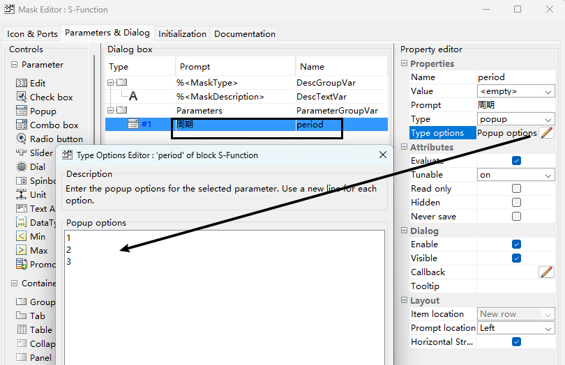
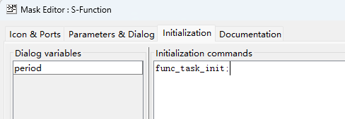
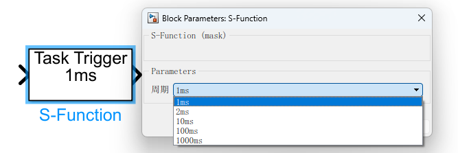
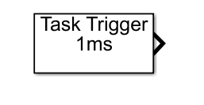
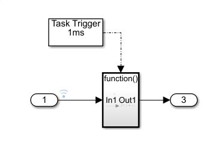

我们选用的是使用脚本函数，自定义来执行模块的创建，显示等操作。


## 1. 外观

- 从库内拖拽一个 `S-Function` 模块，即 `LEVEL 1 FUNCTION` 模块。此模块与 `LEVEL 2 FUNCTION` 的区别，可以参考 [模块](2024/Simulink/模块/index.md) 。




- 创建封装，并增加周期选项。同时，增加可选择值。


- 在 `initialization` 输入初始化函数 `func_task_init;`。



``` matlab
% func_task_init.m
func_task_init_func;

function func_task_init_func()
    p = param;
    taskParam = p.getTaskTime;
    
    set_param(gcbh, "MaskDisplay", "task_icon_display")
    
    maskValueString = taskParam{1};
    
    for i = 2:length(taskParam)
        maskValueString = [maskValueString, "|", taskParam{i}];
    end
    
    maskValueString = ["popup(", maskValueString, ")"];
    maskValues = get_param(gcbh, 'MaskStyles');
    maskValues{1} = strjoin(maskValueString, "");
    set_param(gcbh, "MaskStyles", maskValues);
    
end

% task_icon_display.m
name = "period";
string_name = get_param(gcbh, name);
disp("Task Trigger\n\n");
disp(string_name);

```

以上几个步骤，就可以完成模块的显示和参数了。



## 2. 模块功能

拷贝 `MATLAB\R2014b\toolbox\simulink\simdemos\simfeatures` 中的 `sldemo_sfun_fcncallgen.c` 和 `sldemo_sfun_fcncallgen.tlc` 文件到当前目录。右键选择模块参数，并填写 `S-Function Name` 为 `sldemo_sfun_fcncallgen`， `S-Function Parameters` 为 `sample_time,counts`。
由于当前环境内，并没有 `sample_time,counts` 两个值，需要在 `Matlab` 中手动添加。 在 `Command` 中执行 `sample_time = 1; counts = 1;`。
点击仿真按钮，就可以看到模块发生变化了。后端可以出发一个函数子系统。



## 3. 生成代码


## 4. 代码含义

### 4.1  初始化脚本

``` matlab
% func_task_init.m

% 调用初始化函数，必须在函数定义之前来使用
func_task_init_func;

function func_task_init_func()
	% 声明一个工作空间变量
    p = param;
    % 获取周期时间数组
    taskParam = p.getTaskTime;

	% 设置 icon 的显示函数
    set_param(gcbh, "MaskDisplay", "task_icon_display")

	% 将参数排列成 `"popup(1ms|2ms|10ms|100ms|1000ms)"` 的方式
	% 需要注意，中间是没有空格的
    maskValueString = taskParam{1};
    
    for i = 2:length(taskParam)
        maskValueString = [maskValueString, "|", taskParam{i}];
    end
    
    maskValueString = ["popup(", maskValueString, ")"];

	
    maskValues = get_param(gcbh, 'MaskStyles');
    % 将字符串数组转为字符串，并设置第一个参数的值
    maskValues{1} = strjoin(maskValueString, "");

	% 设置参数
    set_param(gcbh, "MaskStyles", maskValues);
    
end

% task_icon_display.m
% 获取参数名字
name = "period";
% 获取参数的值
string_name = get_param(gcbh, name);
% 在界面上显示
disp("Task Trigger\n\n");
disp(string_name);
```

### 4.2  功能脚本

``` C
#define S_FUNCTION_NAME  sfun_fcncallgen
#define S_FUNCTION_LEVEL 2

#include "simstruc.h"

enum {
	SAMPLE_TIME_ARGC, // 周期时间
	COUNTS_ARGC,      // 迭代次数
	NUM_ARGS,         // 参数个数
};

// 获取周期时间参数
#define SAMPLE_TIME (ssGetSFcnParam(S,SAMPLE_TIME_ARGC))
// 获取迭代次数
#define COUNTS_ARG  (ssGetSFcnParam(S, COUNTS_ARGC))

#ifndef MATLAB_MEX_FILE
/*
 * This file cannot be used directly with the Real-Time Workshop. However,
 * this S-function does work with the Real-Time Workshop via
 * the Target Language Compiler technology. See
 * matlabroot/toolbox/simulink/blocks/tlc_c/fcncallgen.tlc.
 */
# error This_file_can_be_used_only_during_simulation_inside_Simulink
#endif

/* Function: IsRealMatrix =====================================================
 * Abstract:
 *      Verify that the mxArray is a real (double) finite matrix 
 */
boolean_T IsRealMatrix(const mxArray *m)
{
    if (mxIsNumeric(m)  &&  
        mxIsDouble(m)   && 
        !mxIsLogical(m) &&
        !mxIsComplex(m) &&  
        !mxIsSparse(m)  && 
        !mxIsEmpty(m)   &&
        mxGetNumberOfDimensions(m) == 2) {
        
        real_T *data = mxGetPr(m);
        int_T  numEl = (int_T)mxGetNumberOfElements(m);
        int_T  i;

        for (i = 0; i < numEl; i++) {
            if (!mxIsFinite(data[i])) {
                return(0);
            }
        }

        return(1);
    } else {
        return(0);
    }
}
/* end IsRealMatrix */


/*====================*
 * S-function methods *
 *====================*/

#define EDIT_OK(S, ARG) \
       (!((ssGetSimMode(S) == SS_SIMMODE_SIZES_CALL_ONLY) && mxIsEmpty(ARG)))

#define MDL_CHECK_PARAMETERS
static void mdlCheckParameters(SimStruct *S)
{
    /* Note, when the sample time parameter is specified as a variable and
     * it doesn't exist, then the parameter will be []. We don't error
     * out if we are doing a "sizes call only". This is compatible with
     * Simulink.
     */

    if (EDIT_OK(S, SAMPLE_TIME)){
        real_T sampleTime;
        /* Sample time must be a real scalar value. */
        if (IsRealMatrix(SAMPLE_TIME) &&
            mxGetM(SAMPLE_TIME) == 1  &&
            mxGetN(SAMPLE_TIME) == 1) {
            sampleTime = (real_T) (*(mxGetPr(SAMPLE_TIME)));
        } else {
            sampleTime = -10.0; /* force error */
        }

        /* sampleTime == -1  : triggered
         * sampleTime == 0   : continuous
         * sampleTime > 0    : discrete
         */
        if (sampleTime < 0.0 && sampleTime != -1.0) {
            ssSetErrorStatus(S, "Invalid sample time.");
            return;
        }
    }

    /* Check count value. It must be a scalar integer value */
    if (EDIT_OK(S, COUNTS_ARG)){
        boolean_T isOk = IsRealMatrix(COUNTS_ARG);
        if (isOk) {
            int_T  num     = (int_T)mxGetNumberOfElements(COUNTS_ARG);
            real_T *counts = mxGetPr(COUNTS_ARG);
            int_T  i;
            for (i = 0 ; i < num; ++i){
                isOk = (((real_T)((int_T)counts[i]) - counts[i] ) == 0);
                if (!isOk) break;

                isOk = (counts[i] > 0);
                if (!isOk) break;
            }
        }
        if (!isOk) {
            ssSetErrorStatus(S, "Invalid number of iterations. "
                             "Number of iterations must be a matrix with "
                             "positive integer elements.");
            return;
        }
    }
}


static void mdlInitializeSizes(SimStruct *S)
{
    int i;
    ssSetNumSFcnParams(S, NUM_ARGS);

#if defined(MATLAB_MEX_FILE)
    if (ssGetNumSFcnParams(S) != ssGetSFcnParamsCount(S)) return;
    mdlCheckParameters(S);
    if (ssGetErrorStatus(S) != NULL) return;
#endif

    /* Cannot change params while running: */
    for( i = 0; i < NUM_ARGS; ++i){
        ssSetSFcnParamNotTunable(S, i);
    }

    if(!ssSetNumInputPorts(S, 0)) return;

    if(!ssSetNumOutputPorts(S, 1)) return;

    if(EDIT_OK(S, COUNTS_ARG) &&
        !(mxGetM(COUNTS_ARG) == 1 && mxGetN(COUNTS_ARG) == 1)){

        int_T m = (int_T)mxGetM(COUNTS_ARG);
        int_T n = (int_T)mxGetN(COUNTS_ARG);
        if( m == 1 || n == 1){
            int width = m * n;
            if(!ssSetOutputPortVectorDimension(S, 0, width)) return;
        }else{
            if(!ssSetOutputPortMatrixDimensions(S, 0, m, n)) return;
        }
    }else{
        if(!ssSetOutputPortDimensionInfo(S, 0, DYNAMIC_DIMENSION)) return;
    }

    /* All output elements are function-call, so we can set the data type of the
     * entire port to be function-call. */
    // 输出端口类型：  function-call
    ssSetOutputPortDataType(S, 0, SS_FCN_CALL);

    ssSetNumSampleTimes(S, 1);
    ssSetOptions(S, (SS_OPTION_EXCEPTION_FREE_CODE |
                     SS_OPTION_PROPAGATE_COMPOSITE_SYSTEM |
                     SS_OPTION_WORKS_WITH_CODE_REUSE |
                     SS_OPTION_USE_TLC_WITH_ACCELERATOR));
    ssSetEnableFcnIsTrivial(S,1);
    ssSetDisableFcnIsTrivial(S,1);
    ssSetExplicitFCSSCtrl(S,1);


}

// 初始化周期时间
static void mdlInitializeSampleTimes(SimStruct *S)
{
    int_T i;
    real_T sampleTime = (real_T) (*(mxGetPr(SAMPLE_TIME)));

	// 设置采样时间，即周期时间
    ssSetSampleTime(S, 0, sampleTime);
    // 时间偏移
    ssSetOffsetTime(S, 0, (sampleTime == CONTINUOUS_SAMPLE_TIME?
                           FIXED_IN_MINOR_STEP_OFFSET: 0.0));

	 
    for(i = 0; i < ssGetOutputPortWidth(S,0); i++) {
        ssSetCallSystemOutput(S,i);
    }
    ssSetModelReferenceSampleTimeDefaultInheritance(S);
}

static void mdlOutputs(SimStruct *S, int_T tid)
{
    int_T  i, j;
    int_T  width   = ssGetOutputPortWidth(S,0);
    real_T *counts = mxGetPr(COUNTS_ARG);
    int_T  cInc    = (mxGetNumberOfElements(COUNTS_ARG) == 1)? 0 : 1;

    for(i = 0; i < width; i++, counts += cInc) {
        for(j = 0; j < (int_T)(*counts); ++j){
            if (!ssCallSystemWithTid(S,i,tid)) {
                return; /* error handled by Simulink */
            }
        }

    }
}

static void mdlTerminate(SimStruct *S) {}

#if defined(MATLAB_MEX_FILE)
#define MDL_RTW
static void mdlRTW(SimStruct *S)
{
    real_T  *counts = mxGetPr(COUNTS_ARG);
    int_T   numElms = (int_T)mxGetNumberOfElements(COUNTS_ARG);
    % 设置参数给 TLC 使用
    if(!ssWriteRTWParamSettings(S, 1,
                                SSWRITE_VALUE_VECT,
                                "Counter",
                                counts,
                                numElms)) {
        return; /* error handled by Simulink */
    }
}
#endif

#define MDL_ENABLE
static void mdlEnable(SimStruct *S)
{
    int_T  i;
    int_T  width   = ssGetOutputPortWidth(S,0);

    for(i = 0; i < width; i++) {
        if (!ssEnableSystemWithTid(S,i,0)) {
            return; /* error handled by Simulink */
        }
    }
}

#define MDL_DISABLE
static void mdlDisable(SimStruct *S)
{
    int_T  i;
    int_T  width   = ssGetOutputPortWidth(S,0);

    for(i = 0; i < width; i++) {
        if (!ssDisableSystemWithTid(S,i,0)) {
            return; /* error handled by Simulink */
        }
    }
}

#ifdef  MATLAB_MEX_FILE
#include "simulink.c"
#else
#include "cg_sfun.h"
#endif

/* EOF: fcncallgen.c */

```


### 4.3  TLC 脚本

``` TLC

%% 必须和文件名字保持一致
%implements sfun_fcncallgen "C"

%% Function: Enable ==============================================
%% Abstract:
%%  Issue enable events
%%   
%function Enable(block,system) Output
  %openfile tmpBuffer
  %foreach fcnCallIdx = NumSFcnSysOutputCalls
    %% call the downstream system
    %with SFcnSystemOutputCall[fcnCallIdx]
      %% skip unconnected function call outputs
      %if LibIsEqual(BlockToCall, "unconnected")
	%continue
      %endif
      %assign sysIdx  = BlockToCall[0]
      %assign blkIdx  = BlockToCall[1]
      %assign ssBlock = System[sysIdx].Block[blkIdx]
      %assign tidVal  = ParamSettings.SampleTimesToSet[0][1]
      %openfile tmp2Buffer
      %<LibExecuteFcnEnable(ssBlock, FcnPortElement, 0)>\
      %closefile tmp2Buffer
      %if (!WHITE_SPACE(tmp2Buffer))
	%<tmp2Buffer>\
      %endif
    %endwith
  %endforeach
  %closefile tmpBuffer
  %% output buffer
  %if !WHITE_SPACE(tmpBuffer)
    %assign type = ParamSettings.FunctionName
    %if !ISFIELD(system,"PreventComments") || system.PreventComments != "yes"
      /* Function-call Generator Block: '%<Name>' */
    %endif
    %<tmpBuffer>\
  %endif
%endfunction   

%% Function: Disable ==============================================
%% Abstract:
%%  Issue disable events
%%   
%function Disable(block,system) Output
  %openfile tmpBuffer
  %foreach fcnCallIdx = NumSFcnSysOutputCalls
    %% call the downstream system
    %with SFcnSystemOutputCall[fcnCallIdx]
      %% skip unconnected function call outputs
      %if LibIsEqual(BlockToCall, "unconnected")
	    %continue
      %endif
      %assign sysIdx  = BlockToCall[0]
      %assign blkIdx  = BlockToCall[1]
      %assign ssBlock = System[sysIdx].Block[blkIdx]
      %assign tidVal  = ParamSettings.SampleTimesToSet[0][1]
      %openfile tmp2Buffer
      %<LibExecuteFcnDisable(ssBlock, FcnPortElement, 0)>\
      %closefile tmp2Buffer
      %if (!WHITE_SPACE(tmp2Buffer))
	    %<tmp2Buffer>\
      %endif
    %endwith
  %endforeach
  %closefile tmpBuffer
  %% output buffer
  %if !WHITE_SPACE(tmpBuffer)
    %assign type = ParamSettings.FunctionName
    %if !ISFIELD(system,"PreventComments") || system.PreventComments != "yes"
      /* Function-call Generator Block: '%<Name>' */
    %endif
    %<tmpBuffer>\
  %endif
%endfunction   

%function Outputs(block, system) Output
  %openfile tmpBuffer
  %foreach fcnCallIdx = NumSFcnSysOutputCalls
    %% call the downstream system
    %with SFcnSystemOutputCall[fcnCallIdx]
      %% skip unconnected function call outputs
      %if LibIsEqual(BlockToCall, "unconnected")
	    %continue
      %endif
      %assign sysIdx  = BlockToCall[0]
      %assign blkIdx  = BlockToCall[1]
      %assign ssBlock = System[sysIdx].Block[blkIdx]
      %assign num     = SIZE(SFcnParamSettings.Counter, 1)
      %assign idx     = (num > 1) ? fcnCallIdx : 0
      %assign count   = CAST("Number",SFcnParamSettings.Counter[idx])
      %assign tidVal  = ParamSettings.SampleTimesToSet[0][1]

      
      %openfile tmp2Buffer
      %% 生成代码，参数含义未知
      %<LibExecuteFcnCall(ssBlock, FcnPortElement, tidVal)>\
	  %closefile tmp2Buffer
	  
      %if (!WHITE_SPACE(tmp2Buffer))
	    %if count > 1
		  {
		    int_T i = 0;
		    for(i = 0; i < %<count> ; ++i){
	    %endif
	    %% 代码到本地
	    %<tmp2Buffer>\
		%if count > 1  
			}
		  }
		%endif
      %endif
    %endwith
  %endforeach
  %closefile tmpBuffer
  
  %% output buffer
  %if !WHITE_SPACE(tmpBuffer)
    %% 生成代码到 step 中
    %assign type = ParamSettings.FunctionName
    %if !ISFIELD(system,"PreventComments") || system.PreventComments != "yes"
      /* Function-call Generator Block: '%<Name>' */
    %endif
    %% 所生成代码，都会保存到 step 函数中
    %<tmpBuffer>\
  %endif
%endfunction

%% [EOF] fcncallgen.tlc

```


其中 `ParamSettings` 参数可以参考以下内容，使用方式为 `%assign var = ParamSettings.SampleTimesToSet[0][0]` ，可以获取当前选中模块的采样时间。
``` C
// %<ParamSettings>
{
	AliasDataTypeCompliant 0;
	Asynchronous no;
	CallSimulinkStateWithContStates no;
	DataStoreGlobalDSM [];
	DataStoreSource [];
	DirectFeedthrough [];
	DynamicallySizedVectors ["Y0", "NonsampledZCs"];
	ExpectsSeparateComplexMxArrays yes;
	ExplicitFCSSCtrl yes;
	FunctionLevel 2;
	FunctionName sfun_fcncallgen;
	FunctionType "C-MEX";
	GlobalDataStoreSource [];
	HasMdlProjection no;
	HasVariableSampleTime no;
	Inlined yes;
	InputContiguous [];
	IsLinearlyImplicit no;
	MassMatrixType 0;
	SFcnmdlRoutines ["mdlInitializeSizes", "mdlInitializeSampleTimes",
	  "mdlOutputs", "mdlTerminate", "mdlEnable", "mdlDisable", "mdlRTW"];
	SampleTimesToSet [ [0, 0] ];
	UsingUPtrs [];
	WillBeDynamicallyLoaded no
}
```


```C
/*
 * SFcnParamSettings可以由S-Function或者C-Function传递参数。
 ***/
// SFcnParamSettings
{
	Counter [2.0];
	Name "1ms"
}

```


