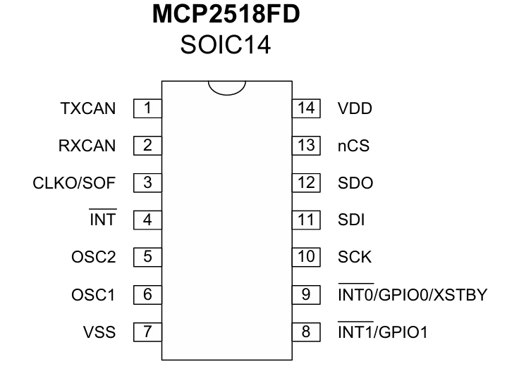

<!--more-->

| 功能       | 介绍                                                     |
| ---------- | -------------------------------------------------------- |
| 通信       | SPI，最高20MHz，模式为(0, 0)或(1, 1)                     |
| 仲裁域速率 | 最大支持 1Mbps                                           |
| 数据域速率 | 最大支持 8Mbps                                           |
| CANFD      | 支持 ISO 11898-1: 2015                                   |
| FIFO       | 31个邮箱，可以配置为发送或接受                           |
| TXQ        | 一个发送队列                                             |
| 消息优先级 | 基于ID的优先级(数值越小，优先级越高)，基于发送队列(FIFO) |
| 自动重发   | 可编程自动触发，也可以关闭                               |
| 报文接受   | 32个固定过滤邮箱                                         |
| 接受时间戳 | 32位时间戳                                               |
| 中断       | 最大有3个中断引脚(TX, RX, INT(low active))                              |
| 诊断       | 总线诊断和错误计数                                       |
| 功耗       | 睡眠电流 15uA                                            |
| 时钟       | 外部 4/20/40MHz 时钟输入                                 |
| 功能安全   | ISO26262 功能安全                                        |

引脚功能如下：

应用框图，可以作为硬件设计参考
