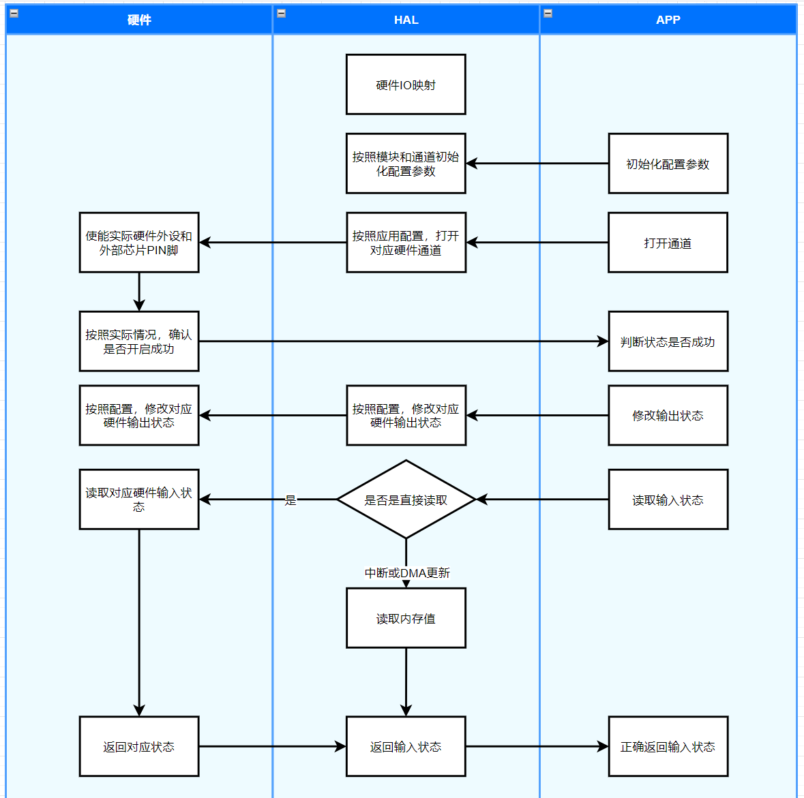

方案需要遵循以下两个原则：

1. 在BSP或者DTS中，设计所有IO管脚的配置，包括各种总线的IO配置，这样修改起来，只需要修改极个别文件即可。
2. 各层级之间尽量相互独立，这样可以保证各个库函数的通用，并且尽可能方便移植。


## IO 类通道设计



IO类通道从设计上，可以看到是按照功能来区分。其中硬件实现功能也分为两种情况，主控芯片内部IO和外部驱动IO，对于这两个情况的区分，就需要BSP或者HAL软件来想办法控制，对于应用来说，只需要按照手册中的引脚描述直接使用即可。


### HAL 硬件抽象层

``` C
enum {
    TM_HAL_IO_INPUT,
    TM_HAL_IO_OUTPUT,
    TM_HAL_IO_INPUT_PULLUP,
    TM_HAL_IO_INPUT_PULLDOWN,
    TM_HAL_IO_INTERRUPT,
};


typedef struct {
    uint8_t enable;
    uint8_t interrupt;
} TM_HAL_IO_INPUT_t;

typedef struct {
    uint8_t enable;
} TM_HAL_IO_OUTPUT_t;
```

硬件抽象层，主要是将所有的IO类硬件，映射到一个表格内，这个表格涵盖了所有硬件的类型、使能、中断、触发、周期等信号。
在BSP或DTS内定义好IO硬件之后，就可以在HAL_IO源码中直接使用。 下面以 LED 为例：

在 DTS 中设计好 LED 灯的IO管脚，这些管脚的定义描述为： 【port，pin，有效电平】，因为对于IO配置信号来说，传入的参数是输出电平是否有效。
``` python
leds {
	compatible = "gpio-leds";
	gpio_leds: gpio_leds {
		/*
		# alarm   PE2
		# run     PB2
		# usb_power  PD4
		# DO PE8~PE15
		*/
		gpios = <&gpioe 2 GPIO_ACTIVE_HIGH>, 
				<&gpiob 2 GPIO_ACTIVE_LOW>,
				<&gpiod 4 GPIO_ACTIVE_HIGH>,
				<&gpioe 8 GPIO_ACTIVE_HIGH>,
				<&gpioe 9 GPIO_ACTIVE_HIGH>,
				<&gpioe 10 GPIO_ACTIVE_HIGH>,
				<&gpioe 11 GPIO_ACTIVE_HIGH>,
				<&gpioe 12 GPIO_ACTIVE_HIGH>,
				<&gpioe 13 GPIO_ACTIVE_HIGH>,
				<&gpioe 14 GPIO_ACTIVE_HIGH>,
				<&gpioe 15 GPIO_ACTIVE_HIGH>;
		label = "User OUT";
	};
};
```

在定义好 IO 管脚之后，就可以在 HAL_IO 源码中引入变量并使用。后续就可以使用 list_led 数组来映射到实际硬件 IO 上，这个方式只针对主控芯片内部 IO 有效。

``` C
/* The devicetree node identifier for the "led0" alias. */
#define LEDS_NODE    DT_ALIAS(leds)
#define INPUT_COUNT  ARRAY_SIZE(list_led)

static const struct gpio_dt_spec list_led[] = {
    DT_FOREACH_PROP_ELEM_SEP(LEDS_NODE, gpios, GPIO_DT_SPEC_GET_BY_IDX, (,))
};
``` 


如果要使用外部驱动芯片，那么可以选用下面一种方式：
在 BSP 或 DTS 中定义好驱动芯片，HAL_IO 中可以直接引用外部芯片驱动变量，填写到对应 output_list 表格内，后续驱动时，可以直接访问该数组。

``` C
#define OUTPUT_DRIVER_NODE DT_ALIAS(output_driver)

static const struct output_driver_spec output_list[] = {
	｛&driver, output, active_level},
};
```


### 应用使用

在应用中，可以以 TM_APP_IO_t 数据类型创建使用变量，所有应用函数都直接依靠这个变量来传输信息，这样可以尽可能抽象出功能，以配合后续不同驱动芯片的支持与移植工作。

``` C
typedef struct {
    uint32_t index: 8;
    uint32_t enable: 1;
    uint32_t level: 1;
    uint32_t direction: 1;
    union {
        struct {
            uint32_t interruptEnable: 1;
            uint32_t interruptMode: 1;
            uint32_t interruptEdge: 1;
            uint32_t interruptCallback: 1;
            uint32_t reserved: 25;
        } INPUT;
        struct {
            uint32_t reserved: 29;
        } OUTPUT;
    } mode;
} TM_APP_IO_t;
```

使用可以按照下面流程来操作：

``` C

// 1. 定义变量
TM_APP_IO_t  io;

// 2. 初始化变量
TM_HAL_IO_Config(&io, 1);

// 3. 打开通道，默认为关闭状态
TM_HAL_IO_Open(&io);

// 4. 修改输出状态或读取输入状态。可以多次修改/读取，直到不需要修改/读取为止
io.level = 1;
TM_HAL_IO_Write(&io);
// 或者
if (TM_HAL_IO_Read(&io) == 0) {
    level = io.level;
}

// 5. 关闭通道，修改为关闭状态
TM_HAL_IO_Close(&io);
```


## Flash 区域划分

